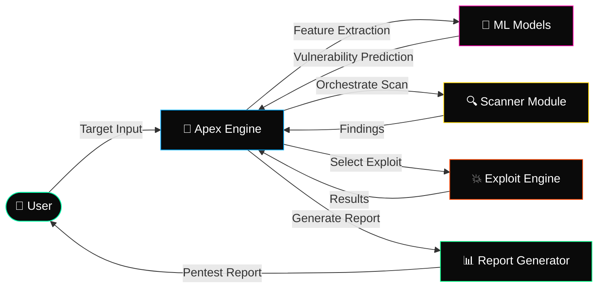

<p align="center">
  
</p>

<p align="center">
  <a href="https://git.io/typing-svg">
    
  </a>
</p>

<p align="center">
  
  
  
  <br />
  
  
  
  
  
</p>

---

## ⚡ Architecture



## 🚀 Quick Start

```bash
# 1. Clone the repository
git clone https://github.com/Ruby570bocadito/Apex-Automation.git
cd Apex-Automation

# 2. Install dependencies
pip install -r requirements.txt

# 3. Run Apex-Automation
python apex.py --target <target>
```

> **Requirements:** Python 3.10+, Linux/WSL environment.

## 🎯 Features

| Feature | Description |
|---------|-------------|
| 🧠 **ML-Driven Discovery** | Machine learning models for intelligent vulnerability prediction and prioritization. |
| 🔍 **Automated Reconnaissance** | AI-guided port scanning, service enumeration, and fingerprinting. |
| 💥 **Smart Exploit Selection** | Context-aware exploit matching based on discovered vulnerabilities. |
| 📊 **Intelligent Reporting** | Auto-generated penetration test reports with findings and remediation. |
| 🎮 **Orchestration Engine** | End-to-end automation from recon to exploitation to reporting. |
| 🕵️ **Vulnerability Analysis** | Pattern recognition and anomaly detection for zero-day discovery. |
| 🔐 **Scope Validation** | Target verification and safe execution boundaries. |
| 📋 **Audit Logging** | Complete traceability of all actions and findings. |

## 🖥️ Usage

```bash
# Full automation pipeline
python apex.py --target 10.0.1.0/24 --full

# Recon only
python apex.py --target example.com --recon

# Exploit specific vulnerability
python apex.py --target 10.0.1.10 --exploit CVE-2023-XXXX

# Generate report from existing findings
python apex.py --report findings.json --output report.pdf

# ML model training mode
python apex.py --train --dataset ./data/training.json
```

## 🏗️ Project Structure

```
Apex-Automation/
├── core/
│   ├── engine.py              # Main automation engine
│   ├── orchestrator.py        # Workflow orchestrator
│   └── validator.py           # Scope & safety validator
├── ml/
│   ├── models/                # Trained ML models
│   ├── features.py            # Feature extraction
│   └── predictor.py           # Vulnerability prediction
├── modules/
│   ├── recon/                 # Reconnaissance modules
│   ├── exploit/               # Exploitation modules
│   └── reporting/             # Report generation
├── data/
│   ├── training/              # Training datasets
│   └── wordlists/             # Built-in wordlists
├── apex.py                    # Entry point
├── requirements.txt           # Dependencies
└── README.md                  # This file
```

## 🛡️ Security & Ethics

Apex-Automation is designed for **authorized security professionals only**. Always:

- ✅ Obtain explicit written permission before testing any system
- ✅ Use only in isolated environments for authorized testing
- ✅ Follow responsible disclosure practices
- ❌ Never use against systems you don't own or have written authorization for

> **Disclaimer:** The authors assume no liability for misuse. You are responsible for complying with all applicable laws.

## 🤝 Contributing

Pull requests are welcome. For major changes, please open an issue first to discuss what you'd like to change.

```bash
# Development setup
git clone https://github.com/Ruby570bocadito/Apex-Automation.git
cd Apex-Automation
pip install -r requirements-dev.txt
```

## 📄 License

[MIT](LICENSE) © 2025 [Ruby570bocadito](https://github.com/Ruby570bocadito)

---

<p align="center">
  <sub>Built for the security community · AI-Assisted Pentesting Automation · ML-Driven Discovery</sub>
</p>
