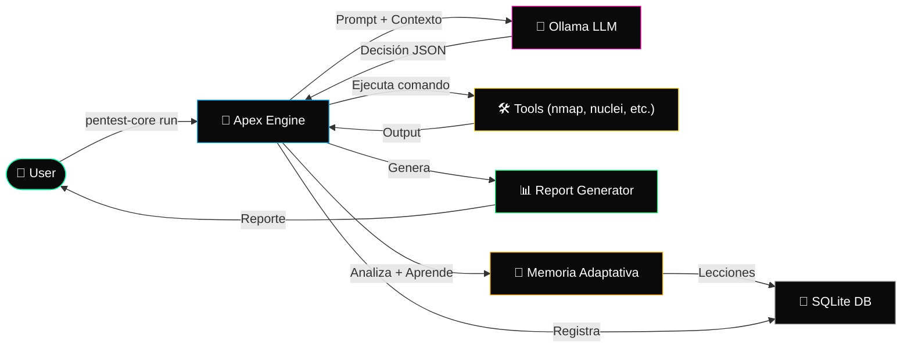

<p align="center">
  
</p>

<p align="center">
  <a href="https://git.io/typing-svg">
    
  </a>
</p>

<p align="center">
  
  
  
  <br />
  
  
  
  
  
</p>

---

**Apex-Automation** es un **agente autónomo de pentesting** impulsado por IA (Ollama). El agente razona como un hacker: observa, analiza, prioriza, ejecuta y pivota — todo sin intervención manual.

El proyecto es un **monolito autónomo** escrito en Python que:
- Usa un **LLM local** (`qwen2.5-coder:7b` vía Ollama) para tomar decisiones en tiempo real
- Mantiene **memoria adaptativa**: aprende de comandos exitosos y fallidos
- Ejecuta comandos del entorno (nmap, gobuster, searchsploit, nuclei, etc.)
- Registra todo en una **base de datos SQLite** con trazabilidad completa
- Genera **reportes profesionales** en Markdown, HTML, JSON y CSV
- Soporta **plugins** para extender funcionalidades
- Incluye **shell interactiva** con comandos en tiempo real

---

## ⚡ Arquitectura



---

## 🚀 Quick Start

### Requisitos

- **Python 3.10+**
- **Ollama** instalado y corriendo ([ollama.ai](https://ollama.ai))
- Modelo: `qwen2.5-coder:7b` (o configurable)
- **Linux / WSL**
- Herramientas del sistema: `nmap`, `gobuster`, `searchsploit`, `nuclei`, `sqlmap`, etc.

```bash
# 1. Instalar Ollama y el modelo
curl -fsSL https://ollama.ai/install.sh | sh
ollama pull qwen2.5-coder:7b

# 2. Clonar el repositorio
git clone https://github.com/Ruby570bocadito/Apex-Automation.git
cd Apex-Automation

# 3. Instalar dependencias Python
pip install -r requirements.txt

# 4. Inicializar proyecto
python main.py init

# 5. ¡Ejecutar un pentest!
python main.py run 10.10.10.123
```

---

## 🎯 Características

| Característica | Descripción |
|---|---|
| 🧠 **Agente IA Autónomo** | Usa Ollama (LLM) para razonar como un pentester: decide qué hacer, cuándo y por qué. |
| 🔍 **Recon Automatizado** | Escaneo de puertos inteligente, enumeración de servicios, fingerprinting con nmap. |
| 💥 **Explotación Contextual** | Busca exploits con searchsploit, ejecuta Metasploit, genera reverse shells. |
| 📊 **Reportes Multi-formato** | Genera reportes en Markdown, HTML (dark theme), JSON y CSV. |
| 🧠 **Memoria Adaptativa** | Aprende de sus errores: no repite comandos fallidos, prioriza patrones exitosos. |
| 🎮 **Shell Interactiva** | Consola en vivo: `!shell`, `!cve`, `!exploit`, `!nuclei`, `!flag`, `!report`. |
| 🔌 **Sistema de Plugins** | Extiende funcionalidades con plugins Python en `plugins/`. |
| 🛡️ **Sanitización de Comandos** | Allowlist de comandos, blacklist de patrones peligrosos (`rm -rf /`, fork bombs). |
| 📋 **Trazabilidad Total** | Base de datos SQLite con sesiones, comandos, CVEs, flags y métricas. |
| 🔄 **Reanudación de Sesiones** | `--resume` retoma sesiones previas automáticamente. |

---

## 🖥️ Uso

### Comandos principales

```bash
# Iniciar un pentest
python main.py run <target>

# Modo agresivo (más paralelismo, exploits automáticos)
python main.py run <target> --aggressive

# Reanudar sesión previa
python main.py run <target> --resume

# Listar sesiones
python main.py list
python main.py list --status running

# Información detallada de sesión
python main.py info <session_id>
python main.py info <session_id> -v

# Generar reporte
python main.py report <session_id>
python main.py report <session_id> --format html
python main.py report <session_id> --format md
python main.py report <session_id> --format json
python main.py report <session_id> --format csv

# Comparar dos sesiones
python main.py diff <session_id_1> <session_id_2>

# Ver lecciones aprendidas por la IA
python main.py lessons

# Limpiar datos
python main.py clean --all

# Inicializar proyecto (crear estructura)
python main.py init
```

### Shell interactiva

Durante un `run`, el agente muestra una shell interactiva con comandos especiales:

| Comando | Función |
|---------|---------|
| `!help` | Mostrar ayuda |
| `!history` | Ver historial de comandos |
| `!repeat N` | Repetir comando N |
| `!status` | Estado actual de la sesión |
| `!flag <texto>` | Registrar una flag |
| `!cve <CVE-ID>` | Información de CVE |
| `!cves` | Listar CVEs detectados |
| `!shell <IP> [PORT]` | Generar reverse shells |
| `!shells` | Listar tipos de shells |
| `!exploit <término>` | Buscar exploits con searchsploit |
| `!nuclei <url>` | Escanear con Nuclei |
| `!report` | Generar reporte inmediato |
| `!ips` | Listar IPs objetivo |
| `!abort` | Abortar la auditoría |
| `!quit` | Salir |

### Ejemplos rápidos

```bash
# Pentest completo a una máquina
python main.py run 10.10.10.123

# Audit ligero + reporte HTML
python main.py run scanme.nmap.org && python main.py report 1 --format html

# Buscar CVEs y generar reporte completo
python main.py run 192.168.1.100 --aggressive
python main.py report 1 --format all
```

---

## 🏗️ Estructura del Proyecto

```
Apex-Automation/
├── main.py                  # Entry point (~1500 líneas) - TODO el código
├── prompts.json             # System prompt del agente IA (en español)
├── prompts.py               # Cargador de prompts
├── test_main.py             # Tests unitarios (pytest)
├── Dockerfile               # Build Docker
├── requirements.txt         # Dependencias Python
├── .gitignore
├── .github/workflows/       # CI/CD: lint, tests, build Docker
├── plugins/
│   └── example_plugin.py    # Plugin de ejemplo
├── checkpoints/             # Checkpoints de sesiones (generado)
├── logs/                    # Logs de ejecución (generado)
├── reports/                 # Reportes generados (generado)
└── vibe_hacker.db           # Base de datos SQLite (generado)
```

---

## 🛠️ Dependencias

### Python (requirements.txt)

```
requests>=2.31.0          # Llamadas API a Ollama y NVD
pytest>=7.4.0             # Tests
pytest-cov>=4.1.0         # Cobertura de código
```

### Herramientas del sistema (instalación recomendada)

```bash
# Ubuntu/Debian
sudo apt install nmap gobuster dirb nikto sqlmap hydra
sudo snap install searchsploit nuclei

# Kali Linux (ya vienen preinstaladas)
```

---

## 🧠 Cómo funciona

1. **Inicio**: El usuario ejecuta `python main.py run <target>`
2. **Prompt**: Se envía un prompt estructurado a Ollama con el objetivo y el contexto de memoria adaptativa
3. **Decisión**: La IA devuelve un JSON con: `thinking`, `decision`, `vibe` (RECON/ENUM/EXPLOIT/POST/SHELL), `action` y `command`
4. **Ejecución**: El comando se sanitiza contra la allowlist y patrones peligrosos, luego se ejecuta con timeout
5. **Análisis**: El output se analiza en busca de flags, CVEs, hashes y credenciales
6. **Aprendizaje**: La memoria adaptativa registra éxitos y fracasos
7. **Ciclo**: El resultado se realimenta a la IA para la siguiente decisión
8. **Reporte**: Al finalizar, se generan reportes en los formatos solicitados

---

## 🤖 Personalización

### Cambiar modelo de IA

Edita `~/.vibehackerrc`:

```json
{
  "ollama_url": "http://localhost:11434/api/chat",
  "model": "mi-modelo-personalizado:latest",
  "auto_exploit_cve": true,
  "aggressive_mode": false,
  "parallel_jobs": 5
}
```

### Crear un plugin

Coloca un archivo `.py` en `plugins/` con una función `register(manager)`:

```python
def register(manager):
    def mi_scan(target: str) -> str:
        return f"Ejecutando scan en {target}"

    manager.register_command("mi_scan", mi_scan)
```

---

## 🛡️ Seguridad y Ética

Apex-Automation está diseñado **exclusivamente para profesionales de seguridad autorizados**. Siempre:

- ✅ Obtén permiso explícito por escrito antes de probar cualquier sistema
- ✅ Usa solo en entornos aislados o con autorización
- ✅ Sigue prácticas de responsible disclosure
- ❌ Nunca uses contra sistemas que no te pertenezcan o sin autorización

> **Aviso:** Los autores no asumen ninguna responsabilidad por el mal uso. Eres responsable de cumplir con todas las leyes aplicables.

---

## 🧪 Tests

```bash
# Ejecutar tests
python -m pytest test_main.py -v

# Con cobertura
python -m pytest test_main.py --cov=main -v
```

---

## 🤝 Contribuir

Las contribuciones son bienvenidas. Para cambios grandes, abre un issue primero.

```bash
# Setup de desarrollo
git clone https://github.com/Ruby570bocadito/Apex-Automation.git
cd Apex-Automation
pip install -r requirements.txt
```

---

## 📄 Licencia

[MIT](LICENSE) © 2025 [Ruby570bocadito](https://github.com/Ruby570bocadito)

---

<p align="center">
  <sub>Built for the security community · Pentesting Autónomo con IA · Agente LLM</sub>
</p>
